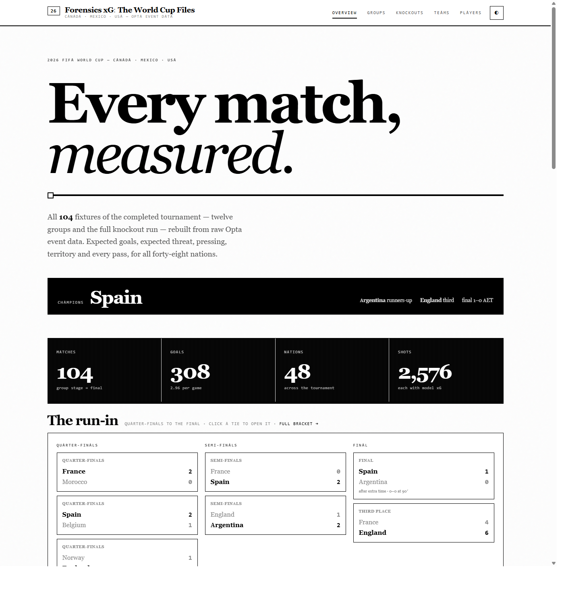
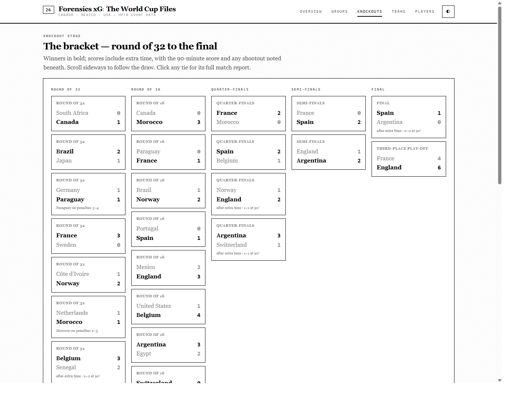
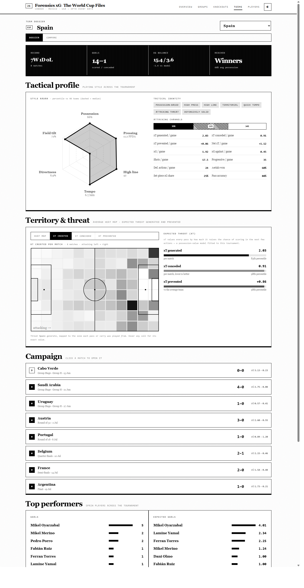
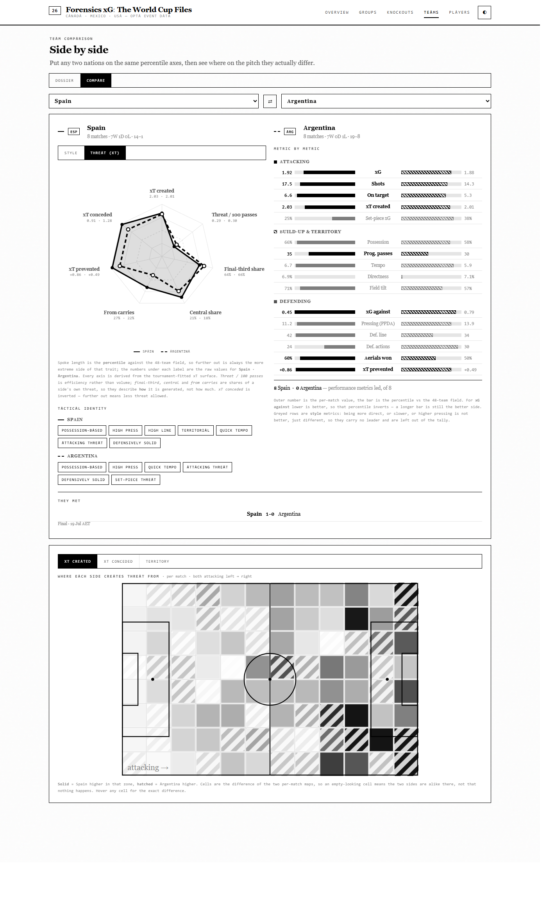
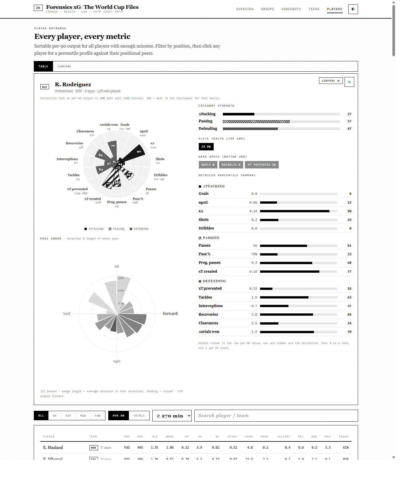
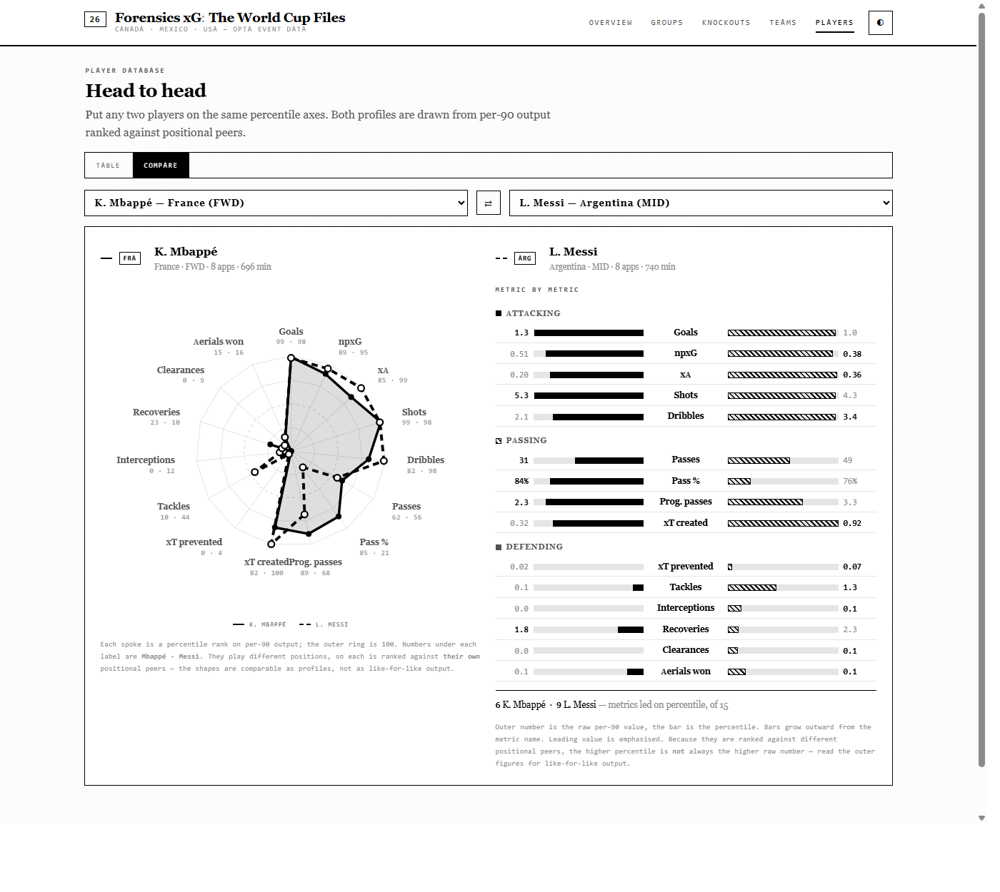
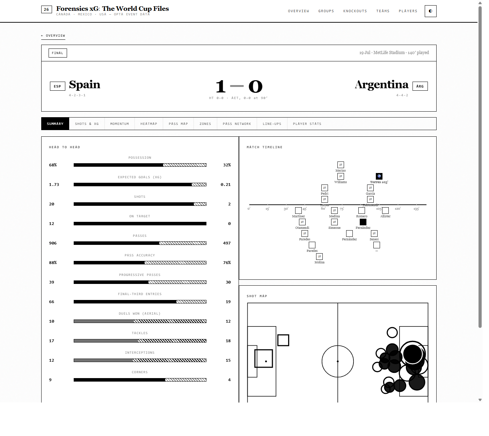
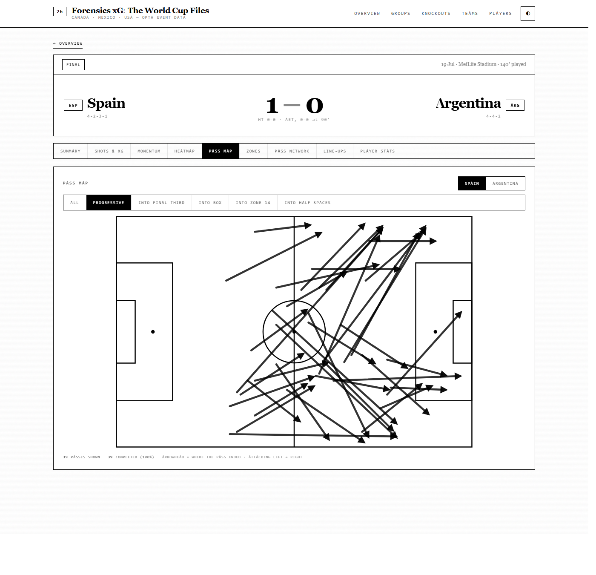

# Forensics xG: The World Cup Files

A self-contained, interactive football analytics dashboard built from **commercial
match-event data** for **all 104 matches** of the 2026 FIFA World Cup
(hosted by Canada · Mexico · USA) — the complete tournament, group stage through to
the final. **Spain** beat Argentina 1–0 after extra time; England took third.

The whole thing builds to **one self-contained HTML file** (~5.7 MB) that runs offline
in any browser. No server, no dependencies, no build step for the reader — open it and
it works.

> **Note on data.** `data.json` and the built dashboard are **not** in this repository.
> The underlying match data is licensed commercial event data, and the built file
> inlines all of it, so neither is redistributed here. The full pipeline is included and will
> rebuild both from your own licensed feed access — see
> [Rebuilding from source](#rebuilding-from-source). The screenshots below are from the real
> build.

---

## What it looks like

| | |
|---|---|
|  **Overview** — champions bar, tournament totals, the run-in |  **Knockouts** — R32 → final, extra time and shootouts noted |
|  **Team dossier** — style radar, identity tags, ruled xT maps |  **Team head-to-head** — xT radar, metric ledger, spatial differential |
|  **Player profile** — percentile pizza, pass sonar |  **Player head-to-head** — overlaid radar, mirrored ledger |
|  **Match centre** — head-to-head, timeline, shot map |  **Pass map** — filtered, with direction |

---

## What's inside

**Overview** — the champions bar, hero stats (104 matches, 308 goals, 48 nations), the run-in
mini-bracket (QF → SF → Final), the **Golden Boot** race and other leaderboards
aggregated across the whole tournament, and a clickable team ledger.

**Groups** — all 12 group tables (final standings, qualifiers ruled in the margin) with every result.

**Knockouts** — the full bracket, Round of 32 → Final, winners in bold, extra-time
and penalty results noted, with the third-place play-off alongside the final.

**Teams** — a team dossier for **any of the 48 nations** (dropdown selector): record,
xG balance, tournament reached, the full campaign rail, **top performers** (six boards:
goals, expected goals, **xT generated**, **xT prevented**, progressive passes and ball
recoveries — squad totals, so they reward a full tournament as well as a good one), and a
**tactical profile** — a style radar (possession, pressing, high line, tempo,
directness, field tilt, each as a percentile vs the 48-team field), auto-generated
identity tags (e.g. *Possession-based · High press · High line*), the attacking-channel
split (left/central/right), and per-game style metrics.

Plus **Territory & threat** — four switchable pitch maps for the whole campaign:

| Map | Shows |
|---|---|
| **Heat map** | every on-ball action, all matches combined |
| **xT created** | where the side generates threat *from* (zone each pass/carry was played from) |
| **xT conceded** | where opponents generate threat from against them — where they get opened up |
| **xT prevented** | **diverging**: solid ink = concedes *less* threat from that zone than the average team, hatched = concedes more |

alongside **xT generated, conceded and prevented** per match with percentiles vs the
field. *xT prevented* = how far below the tournament's average xT conceded a side keeps
its opponents (positive = better than average).

**Every pitch map is a ruled 12×8 grid** — discrete cells, no blur, with the exact
value for any cell on hover. The data is binned to that lattice, so smoothing it back
out implies a spatial precision that isn't there. A zone's net xT can be negative
(backward passes shed threat), so the shading ramp clamps at zero while the tooltip
reports the true signed value.

Touch maps carry one extra wrinkle. Their density varies enormously — a team's whole
campaign fills all 96 cells, one player in one match lights up a dozen — so scaling to
the single busiest cell left the sparse ones nearly blank. They instead scale to the
**95th-percentile** busy cell and saturate above it, and the contrast ramp is **solved
from the data**: the gamma is chosen so the median occupied cell always lands at ~0.35
opacity. A near-uniform campaign map therefore gets a steep ramp so hot zones separate,
while a spiky single-player map gets a shallow one so its zone stays visible. No single
fixed gamma serves both — 2.0 erased a 91-touch player, 1.0 blackened a whole team.

**Team comparison** (the *Compare* tab in Teams) — puts any two nations side by side:

- **Overlaid radar**, switchable between **Threat (xT)** and **Style**, using the same
  solid/dashed encoding as the player head-to-head, with each side's auto-generated
  identity tags beneath. Spoke length is always the percentile vs the 48-team field;
  the numbers under each label are the raw values.

  The **threat radar** is the default, and decomposes each side's expected threat into
  seven axes — not just *how much*, but *how* and *from where*:

  | Axis | Reads |
  |---|---|
  | **xT created** | threat generated per match — raw volume |
  | **Threat / 100 passes** | efficiency: how much threat per unit of ball |
  | **Final-third share** | how much of its threat is created in the attacking third |
  | **Central share** | how much comes through the middle rather than the flanks |
  | **From carries** | how much is generated by carrying rather than passing |
  | **xT prevented** | threat suppressed vs the average team |
  | **xT conceded** | threat allowed — *inverted*, so further out is fewer |

  The last four are all derived client-side from data already shipped (the per-zone
  `xtz` grids, per-player carry xT, and pass volume), so this needed no ETL change.
  Shares use only the **positive** cells of a zone grid as the denominator — a zone
  with net-negative xT (backward passes shedding threat) would otherwise inflate every
  other share. The three share axes describe *shape*, not quality: a high central share
  isn't better than a wide one, just different.
- **Metric-by-metric ledger** — sixteen per-match metrics as mirrored bars. These are
  split into **performance** metrics, which have a genuine better/worse direction and
  carry a leader, and **style** metrics (possession, directness, tempo, field tilt,
  PPDA, defensive line, set-piece share, defensive actions), which are greyed and carry
  no leader — being more direct or higher-pressing is not better, just different, so
  declaring a winner there would be meaningless. Only the eight performance metrics
  count toward the tally.
- **Head-to-head** — if the two actually met, every meeting with its stage and result.
- **Spatial differential** — a diverging 12×8 map of A *minus* B, switchable between
  **xT created / xT conceded / territory**. Solid = A higher in that zone, hatched = B
  higher. This is the part a stats table can't give you: it answers *where* the two
  sides differ, not just who is better. Like the touch maps it uses 95th-percentile
  normalisation, since one lopsided zone otherwise flattens every other difference.

**Players** — a full **player database**: sortable per-90 output (goals, xG, shots,
progressive passes, tackles+interceptions, recoveries, dribbles, aerials, pass %) with
position and minutes filters. Click any player for a full scouting profile:

- **Pizza chart** — a radial chart with one wedge per metric, radius = percentile rank,
  wedges grouped into contiguous **Attacking / Passing / Defending** arcs (solid / hatched
  / grey fills, since the palette is monochrome), each
  labelled with its raw per-90 value. Outfielders get 12 slices; goalkeepers get a
  GK-specific 7-slice set (saves, clearances, recoveries, aerials, distribution).
- **Detailed percentile summary** — every metric grouped by category with its raw per-90
  value, a percentile bar and rank, plus **category strength** averages (Attacking /
  Passing / Defending) and auto-flagged **elite traits** (top 20%) and **weak spots**
  (bottom 20%).
- **Pass sonar** — a polar histogram of every pass the player made, binned into 16
  directions: wedge length = average pass distance that way, shading = volume, with the
  share played forward. Reads a player's distribution habits at a glance.

Players carry two expected-threat metrics, both in the table and the pizza:

- **xT created** — threat the player added with their own passes and carries.
- **xT prevented** — every ball-winning action (successful tackle, interception,
  clearance, ball recovery) valued by **the threat the opponent held at that spot**.
  The feed records coordinates in the acting team's attacking frame, so the opponent's
  threat sits at the mirrored point, and the xT surface is read there. Winning the ball
  on your own goal line is therefore worth far more than a recovery in the opposition
  half — which is the point of weighting by threat instead of counting tackles. It
  separates cleanly by role: centre-backs top it at ~1.1/90 against a midfield median
  of 0.18.

There is deliberately **no player "xT conceded"**. Event data has no off-ball defensive
positions, so opponent threat cannot honestly be attributed to an individual defender;
the only computable version is team xT conceded while the player was on the pitch, which
is a plus/minus team-context number and would read as a skill rating it isn't.

Percentiles are always vs same-position players with **≥180 minutes** (a stable peer
floor, independent of the table's minutes filter), so a profile doesn't shift as you
change the view.

**Head to head** (the *Compare* tab, or the **Compare ⇄** button on any profile) — puts
any two players on one set of percentile axes:

- **Overlaid radar** — both profiles on the same spokes. Player A is filled with a solid
  outline and solid dots; player B is outline-only, dashed, with hollow dots. Only one
  side carries a fill on purpose: hatching both turns the overlap into mud.
- **Metric-by-metric ledger** — mirrored bars growing outward from the metric name, raw
  per-90 value on each flank, the leading value emphasised, and a tally of metrics led.

If the two play different positions each is ranked against **their own** positional
peers, which the panel says explicitly — the shapes then compare as *profiles*, not as
like-for-like output, and the higher percentile is not always the higher raw number.

**Match Centre** (click any match) —
- **Summary** — head-to-head comparison bars, a lane-stacked match timeline, shot map
- **Shots & xG** — full shot map (size ∝ xG, ringed = goal), a cumulative-xG race chart, and an every-shot table
- **Momentum** — net-xG-per-5-minutes diverging bars (sqrt-scaled)
- **Heatmap** — touch map from every on-ball action, binned to a ruled 12×8 grid under
  the pitch lines, exact count per cell on hover. Whole team or **any individual player**.
- **Pass map** — every pass drawn start→end with an **arrowhead at the receiving end**,
  filterable to **Progressive / Into final third / Into box / Into zone 14 / Into
  half-spaces**, with completion counts. Heads are built in SVG space rather than pitch
  space (the pitch is vertically squashed, so a head computed from raw pitch coordinates
  points slightly wrong), sized down and drawn at line opacity on the unfiltered view —
  which runs to ~500 passes a side — and clamped so a short pass never gets an arrowhead
  longer than the pass. The line stops short of its head so the two don't merge.
- **Zones** — **zone 14 and the half-spaces** overlaid on the pitch with action counts,
  a head-to-head zone-occupation comparison (touches and passes into zone 14, the
  half-spaces, the box and the final third), and who occupied zone 14 most.
- **Pass network** — average positions + the 14 strongest combination links, per team.
  Restricted to the **starting XI** (with ≥8 passes): a full-match network already
  mixes players who were never on the pitch together, and adding substitutes on top
  of that makes the shape unreadable
- **Line-ups** — both formations on one pitch (lines inferred from real average positions), plus substitutes
- **Player stats** — a sortable per-player table

Full-page inversion toggle (◐, top-right). Deep-linkable via URL hash, e.g.
`#view=knockouts` or `#view=match&mi=40&tab=shots&theme=light`.

## Corrections (18 Jul)

An audit of the pipeline and the renderer turned up eleven defects, all since fixed
and re-verified. Worth recording because several were silent — they produced
plausible-looking numbers rather than errors:

| Defect | Effect | Fix |
|---|---|---|
| Minutes used `matchLengthMin` | Wall-clock **including stoppage** (99–108, or 130–144 with ET) credited as minutes played. Total 234,898 vs 207,049 true — **every per-90 rate understated by 5–26%, by a different amount per player**, which quietly broke cross-player comparison | Football clock: each period clamped to its nominal length, 90 or 120 |
| Red cards never ended the clock | 14 dismissed players credited ~605 excess minutes (a 32nd-minute red still billed 105) | Dismissal closes the player's match |
| `scores.ft` is the **normal-time** score | 4 knockouts shipped a drawn scoreline. Worse, the bracket inferred "won on penalties" from *drew yet somebody won*, **inventing four shootouts that never happened** | Take `scores.et`; ship `reg`, `aet` and real `pens` and read them explicitly. (Not `total` — that folds penalties into the scoreline) |
| Corners counted both outcomes | the feed logs a corner twice, for the team taking and the team conceding. 18.4 per match against a true 9.2, half attributed to the wrong side | Count `outcome == 1` only |
| Set-piece xG = "no qualifier 22" | Fast breaks (23) and throw-ins (160) carry no set-piece qualifier either, so 247 open-play shots landed in the set-piece bucket. Share read 37.1% vs 27.3% true | Open play = qualifier 22, 23 or 160 |
| Carries crossed dead balls | `prev_ball` was never invalidated, so the last touch of a half "carried" into the next, and a blocked shot carried to the corner flag. ~5% of derived carries spurious | Reset on period change and on any dead-ball event |
| Own goals missing from `goals_ev` | Event-derived team goals 283 vs 297 actual | Credit the benefiting side |
| Bench players had no formation slot | qualifier 131 is `0` for the bench and `pos_group` fell through to `FWD`, so **254 players had no real position** and were ranked against a bogus 8-player "SUB" pool | Learn each position's average touch-x from the starters, classify by nearest centroid |
| Totals mode tested `c.k === 'xg'` | No column has that key, so the branch was dead and **every total was rounded** — npxG 4.7 rendered as "5" while the sort used the true value | Round counting stats, keep decimals on npxG / xA / xT |
| Compare button under 180 min | Selecting a player the table allows (≥90) but the picker didn't (≥180) silently swapped in two different players | Picker floor lowered to 90; peers stay at 180 |
| Unvalidated `mi` / `net` / `tab` in the hash | A stale or hand-edited link blanked the page (`render()` clears `#app` before the view throws) | Validate and clamp at the boot parser, plus a guard where the invariant is used |

xG calibration still reconciles after all of this, and again after the final and
third-place play-off were added and the factor refit: non-penalty xG 278.0 against
278 non-penalty goals.

## Player positions

The feed's formation slot (qualifier 131) is the **traditional position number**, not a
depth ordering. Verified against median pitch position pooled over all 208 team-matches:

| Slot | 1 | 2, 3 | 5, 6 | 4 | 8 | 10 | 9 | 7, 11 |
|---|---|---|---|---|---|---|---|---|
| Role | GK | RB, LB | CB | CM | CM | CAM | ST | wide |
| Median x | 11.8 | ~52 | ~37 | 47.9 | 51.0 | 60.8 | 62.0 | ~60 |

The original table read slots 2–6 as defenders, which put **slot 4 — a central
midfielder — in defence**. That is why Declan Rice registered as a defender.

Three slots are genuinely ambiguous, and no fixed table separates them:

- **7 and 11** hold out-and-out wingers (Yamal avg x 72.4, Dembélé 69.2) *and* central
  midfielders pushed wide (De Paul 53.0, Gravenberch 58.2).
- **10** is a second striker in 4-4-2 / 4-3-3 / 4-2-3-1 (median x 60.5–64.7) but a genuine
  central midfielder in 4-1-4-1 / 5-4-1 (46.1–51.8).

All three are resolved by nearest centroid on the player's real average position. Two
details matter, both of which produced visible errors when I got them wrong:

1. **Slot 10 still counts toward the MID reference** even though it is reassignable.
   Dropping it leaves MID anchored on slots 4 and 8 — the *deep* central midfielders —
   which pulls that centroid from 51.7 down to 47.4, drags the MID/FWD boundary to ~54.6
   and starts calling ordinary attacking midfielders forwards.
2. **Ambiguous starts are resolved before the modal vote** across a player's matches,
   not after. Otherwise a winger with six wide starts and one central start is called a
   midfielder on the strength of that single start.

A player's final position is the **most common** across their starts. Substitutes, who
carry no slot at all, are inferred from average touch position by the same centroids.

Spot-checked against 29 players whose roles are not in doubt — Messi, Mbappé, Haaland,
Bellingham, Rodri, Rice, De Bruyne-class names across all four lines: **29 correct**.

## Pitch orientation (corrected 20 Jul)

The feed's `y` axis runs 0–100 across the pitch with **0 on the attacking team's right**.
Verified empirically rather than from documentation, against players whose flank is not
in doubt — Cucurella 85.6, Theo Hernández 85.7, Leão 86.8, Vinícius 80.6 on one side;
Wan-Bissaka 13.3, Hakimi 14.3, Koundé 15.5, Yamal 16.8, Saka 17.7 on the other.

Two consequences were wrong and are now fixed:

1. **Every pitch graphic was a vertical mirror.** `PY()` mapped `y` straight to SVG `y`,
   which grows downward, so low `y` (the right flank) drew at the top. Right-wingers
   appeared on the left. `PY` now inverts (`(100-y)*YK`), and the heat/xT grids — which
   position cells from the row index rather than through `PY` — invert their row order to
   match. Pitch markings are vertically symmetric, so they were unaffected.
2. **Left and right were transposed in every label.** `att_left`/`att_right`,
   `in_hsL`/`in_hsR`, the zone tooltips, and the *Left-sided* / *Right-sided* identity
   tags all had it backwards. Morocco, who attack down Hakimi's flank, were being labelled
   left-sided; they now read 47% right / 28% left.

Counts and geometry were never affected — zone 14, the combined half-space totals, xT and
the heat maps are all symmetric about the axis. It was the orientation and the naming.

## Methodology & caveats

- **Expected goals (xG)** — the source feed carries **no native xG**, so each shot is
  scored by a **geometric logistic model** fitted (least squares) to realistic
  open-play anchors using shot distance and the angle subtended by the goal; headers
  (×0.55), set-pieces (×0.65) and penalties (fixed 0.76) are adjusted. Following the
  *Forensics xG* approach, non-penalty xG is then **calibrated (×1.2401) so predicted
  goals sum to observed goals** across the tournament — non-penalty xG 278.0 vs 278
  actual non-penalty goals, 0.01% off. (The factor is refit whenever matches are added:
  the 102-match fit of ×1.222 had drifted to −1.5% by the end of the tournament.) Treat it as a *shot-quality estimate*, not vendor xG.
- **npxG** (non-penalty xG) and **xA** are included. xA is derived by crediting a shot's
  xG to the player who made the immediately preceding completed pass for that team
  (a shot-assist derivation, so it covers all chances created, not just goal assists).
- **Expected Threat (xT)** is **fitted to this tournament's own data**, not a borrowed
  grid. Over a 12×8 zone grid it solves, by value iteration,
  `xT(z) = P(shoot|z)·P(goal|shot from z) + P(move|z)·Σ T(z→z')·xT(z')`,
  where move/shot probabilities and the transition matrix `T` come from all 110k passes
  and 2.5k shots, and `P(goal|shot)` comes from the calibrated xG model at each zone
  centroid. Crucially the move denominator counts **all pass attempts** while only
  completions carry value forward — that leak represents turnovers and is what stops the
  surface converging to a flat sheet. The resulting surface runs from ~0.004 in a team's
  own box to ~0.40 in front of goal, and independently reproduces the zone-14 effect (the
  central pre-box pocket values ~0.124 vs ~0.04 for the wide areas at the same height).
- **Moves include carries as well as passes.** The feed has no carry events, so carries
  are **derived**: when the ball comes to rest at one point and the same team's next
  on-ball action starts somewhere else (3–60 units away), that movement is credited to
  the player who made the next action. Carries feed both the transition model and the
  crediting, and lift tournament xT from 1.31 to **1.68 per team-match** (~+28%).
  Every completed pass and carry is credited `xT(end zone) − xT(start zone)`.
- **Pitch zones** use a consistent **5-lane model** so zone 14 and the half-spaces tile
  without overlapping: wide `0–21` | half-space `21–36.8` | central `36.8–63.2` |
  half-space `63.2–79` | wide `79–100`, with **zone 14** = the central lane between the
  final-third line and the box (`x 66.7–83`). The box is `x ≥ 83, y 21–79`.
- **Possession** is completed-pass share (the feed has no ball-clock).
- **Progressive pass** = completed pass advancing ≥15 units into x≥50 territory.
- **On-target** excludes blocked shots (typeId 15 + qualifier 82).
- **Own goals** are credited to the opponent in the timeline and excluded from shot maps and shot/xG totals.
- **Extra time** (periods 3–4) is included; **penalty shootouts** (period 5, e.g. Netherlands–Morocco) are excluded from all analytics — the displayed result is the FT/AET score from the feed's match details.
- **Line-up shape** classifies players into formation lines by their real average
  x-position (slot numbers are not linearly def→fwd), then lays them out idealised.
- **Tactical metrics** (from event locations): **PPDA** = opponent passes in their own
  60% ÷ the team's defensive actions there (low = intense press); **defensive-line height**
  = mean x of tackles/interceptions/recoveries/clearances; **field tilt** = share of both
  teams' final-third passes; **directness** = share of long balls; **channels** = final-third
  passes split left/central/right; **tempo** = passes per minute; **set-piece xG share** =
  non-open-play shot xG. Team profiles average these across a nation's matches and rank
  them into percentiles vs the field.
- **Player minutes** are derived from starter status + substitution on/off events; all
  player rates are **per 90** and gated behind a minutes filter so small samples don't skew.

## Rebuilding from source

```bash
# 1. put your match-event feeds somewhere, then:
export WC_FEEDS=/path/to/wc2026_feeds     # defaults to ~/Downloads/wc2026_feeds

python etl.py     # parse every World Cup feed found there -> data.json
python build.py   # inline data.json + app.js into template.html -> the single HTML
```

`etl.py` auto-discovers the feeds, so adding matches is just dropping the new files in
and re-running both scripts. One caveat: `K_CAL` in `etl.py` is a tournament-wide xG
calibration and should be refit whenever the match set changes — the 102-match value had
drifted 1.5% by the time the final was played.

- `etl.py` — feed parser + all metric computation
- `app.js` — the dashboard application (vanilla JS, SVG charts, no dependencies)
- `template.html` — markup + design-system CSS (theme-aware, responsive)
- `build.py` — inlines everything into the shippable single file

---

## Design system — Minimalist Monochrome

The interface is pure black and white: no accent colour, zero border-radius, no
shadows. Depth comes from rules, inversion, scale and negative space.

**Typography.** Playfair Display (headlines), Source Serif 4 (prose), JetBrains Mono
(every numeral, label and nav item). The fonts are downloaded, **subsetted to the 194
glyphs this dashboard actually renders** — including the latin-ext needed for names
like Kramarić, Bardakcı and Hložek — and inlined as base64 woff2. That's 198 KB of
original woff2 down to **30 KB**, so the file stays fully offline with no webfont
requests. Rebuild with `python build_fonts.py`.

**Tokens.** All colour lives in one `:root` block in `template.html`. The legacy token
names (`--home`, `--cat-att`, …) were kept and remapped onto the monochrome scale, so
every chart resolves through the existing `cssv()` helper — the palette is a single
point of change. The theme toggle performs a full **inversion** rather than swapping to
a separate dark palette.

**Encoding without colour.** Data series can't use hue, so they use fill, texture and
shape instead:

| Distinction | Encoding |
|---|---|
| Home vs away — shot map | **circle** vs **square** |
| Home vs away — bars | solid vs **45° hatch** |
| Cumulative xG lines | solid vs **dashed** |
| Shot outcome | solid = on target · hollow = off · ringed = goal |
| xT prevented (diverging) | solid ink vs **hatched** ink |
| Pizza categories | solid / hatched / mid-grey |
| Player A vs B — radar | filled + solid outline vs **dashed** outline, solid vs hollow dots |
| Player A vs B — bars | solid vs **45° hatch**, mirrored about the label |
| Attacking channels | solid / hatched / open |
| Won · drawn · lost | solid / outline / hatched |
| Group qualification | a solid rule in the margin |

There are **no colour literals left in `app.js`** — grep for hex or `hsl(` returns
nothing. Contrast is 21:1, and all interactive elements carry 3px focus-visible
outlines.
